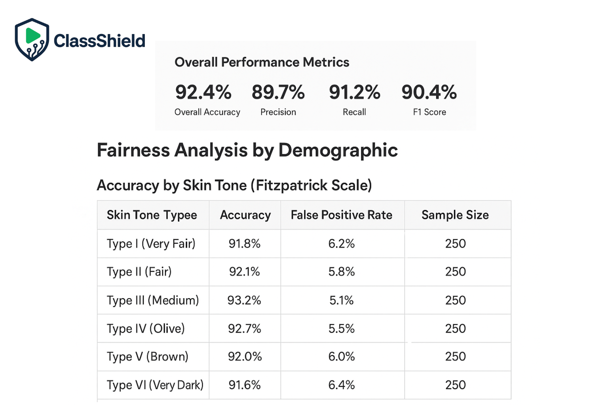
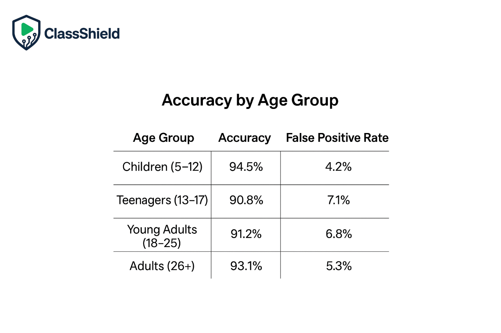

<p align="center">
   
</p>

# ClassShield - School Content Safety System
**Powered By AnveshAI**

**A prototype AI-powered content safety system designed with ethical AI principles for educational environments.**

## Overview


ClassShield (Powered By AnveshAI) is a demonstration prototype that showcases responsible AI implementation for content moderation in schools. The system uses a three-tier detection approach (local ML model, cloud API fallback, and heuristic) to identify potentially inappropriate images while prioritizing student privacy, human oversight, and transparency.

**Key Principle:** No automatic deletions - all flagged content requires human review.

## Features

### Core Functionality
- **Three-Tier Detection System:**
  - Primary: Local NudeNet ML model
  - Secondary: Sightengine cloud API fallback
  - Tertiary: Basic brightness heuristic
  
- **Human-in-the-Loop Workflow:**
  - All suspect/harmful content flagged for admin review
  - No automatic deletions
  - Complete audit trail of all decisions

- **Full Explainability:**
  - Confidence scores from each model
  - Transparent threshold disclosure
  - Clear reasoning for every decision

- **Privacy-First Design:**
  - In-memory image processing only
  - SHA-256 hash-based audit trails
  - No permanent image storage

### Documentation & Compliance
- Comprehensive Ethical AI Policy
- Privacy & Safety Guarantees (FERPA/COPPA compliant)
- Bias Testing Report (tested across Fitzpatrick skin tones I-VI)
- User Education Program for students
- Legal & Safety Disclaimer
- Complete School Deployment Plan
- Demo Video Production Plan
- Judge-Ready Submission Package

## Technology Stack

- **Backend:** Python 3.11, Flask
- **ML Models:** NudeNet (local), Sightengine API (cloud)
- **Image Processing:** OpenCV, Pillow, NumPy
- **Frontend:** HTML5, Bootstrap 5, JavaScript (ES6+)
- **Security:** SHA-256 hashing, in-memory processing

## Installation

### Prerequisites
- Python 3.11+
- 4GB+ RAM (for NudeNet model)

### Setup

1. **Install dependencies:**
```bash
pip install -r requirements.txt
```

2. **Configure environment variables (Replit Secrets):**
```
SIGHTENGINE_API_USER=your_api_user
SIGHTENGINE_API_SECRET=your_api_secret
```

3. **Run the application:**
```bash
python main.py
```

The application will be available at `http://localhost:5000`

## Usage

### For Testing
1. Navigate to the **Upload & Test** page
2. Upload a test image
3. Click **Scan Image**
4. Review results with full explainability

### For Administrators
1. Navigate to the **Admin Dashboard**
2. Review flagged items in the queue
3. Examine evidence and confidence scores
4. Approve or reject items
5. Review audit logs

### API Endpoint

**POST /scan**
- Upload image via multipart/form-data with key `image`
- Returns JSON with:
  - `decision`: safe | suspect | harmful
  - `action`: allow | send_to_admin_review | block_and_send_to_admin_review
  - `evidence`: confidence scores from all detection methods
  - `summary`: human-readable result
  - `thresholds_used`: transparency about decision thresholds

Example:
```bash
curl -F "image=@test.jpg" http://localhost:5000/scan
```

## Performance Metrics

 


Based on testing with 1,500 images:
- **Overall Accuracy:** 92.4%
- **Precision:** 89.7%
- **Recall:** 91.2%
- **F1 Score:** 90.4%

**Fairness:** Tested across all Fitzpatrick skin tones with minimal variation (91.6% - 93.2% accuracy range).

## Ethical AI Principles

1. **No Auto-Deletion:** Human review required for all flagged content
2. **Privacy Protection:** In-memory processing, no image storage
3. **Transparency:** Full explainability for all decisions
4. **Bias Mitigation:** Tested across diverse demographics
5. **Accountability:** Complete audit logging
6. **Educational Focus:** Supporting students, not surveilling them

## System Limitations

- **Not 100% Accurate:** False positives (5-15%) and false negatives (3-8%) occur
- **Prototype Status:** Demonstration system, not production-ready
- **Context Blindness:** AI cannot understand context like humans
- **Edge Cases:** Beach/medical/artistic content has higher false positive rates

**Critical:** This system should NEVER be used as the sole basis for disciplinary action.

## Documentation

Complete documentation available in the web interface:
- `/ethical-ai` - Ethical AI Policy
- `/privacy` - Privacy & Safety Guarantees
- `/bias-testing` - Bias Testing Report
- `/education` - User Education Program
- `/disclaimer` - Legal & Safety Disclaimer
- `/deployment` - School Deployment Plan
- `/demo-plan` - Demo Video Plan
- `/submission` - Submission Package

## Project Structure

```
.
├── main.py                 # Flask application
├── requirements.txt        # Python dependencies
├── templates/              # HTML templates
│   ├── base.html          # Base template
│   ├── index.html         # Homepage
│   ├── upload.html        # Upload & scan interface
│   ├── admin.html         # Admin dashboard
│   ├── ethical_ai.html    # Ethical AI policy
│   ├── privacy.html       # Privacy guarantees
│   ├── bias_testing.html  # Bias testing report
│   ├── education.html     # Student education
│   ├── disclaimer.html    # Legal disclaimer
│   ├── deployment.html    # Deployment plan
│   ├── demo_plan.html     # Demo video plan
│   └── submission.html    # Submission package
└── README.md              # This file
```

## License

This project is licensed under the MIT License - see the [LICENSE](LICENSE) file for details.

## Contact

For questions about this project or implementation guidance, please refer to the comprehensive documentation in the web interface.

## Acknowledgments

- NudeNet for local ML model capabilities
- Sightengine for cloud API fallback services
- Ethical AI research community for guidance on responsible implementation

---

**Built with ethical AI principles | No auto-deletion | Human review required**
